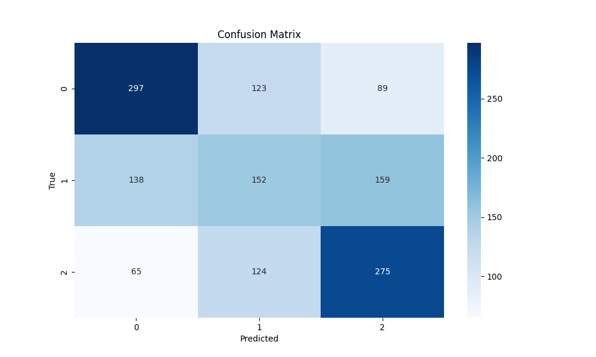
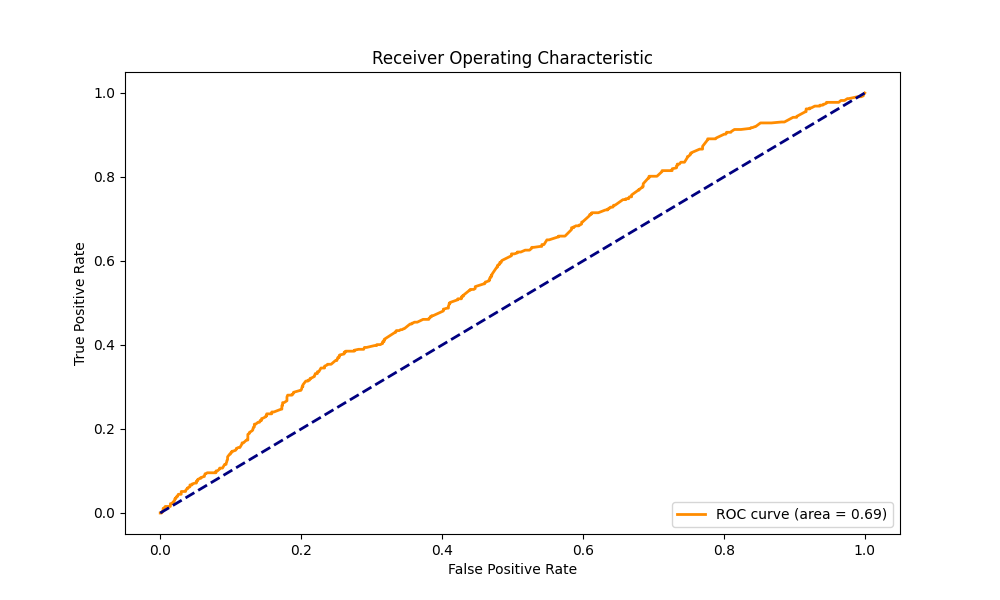
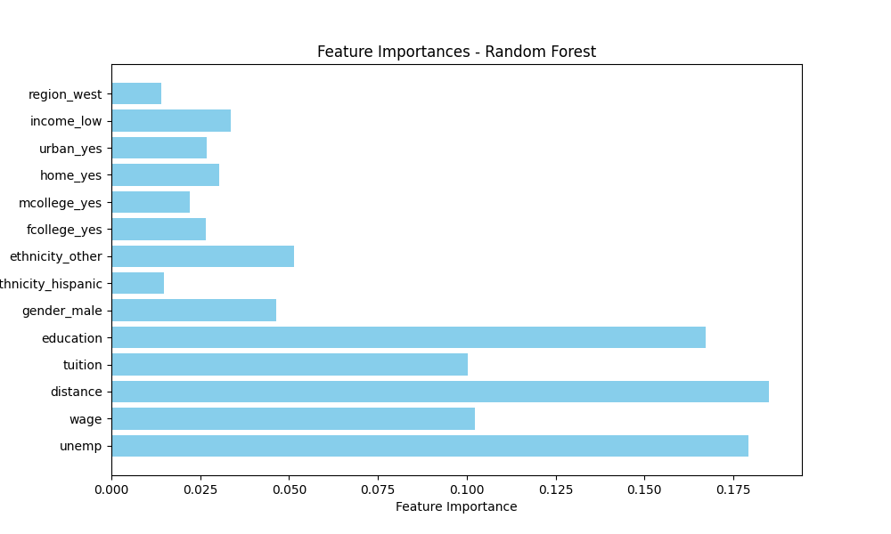

# LabX1

Korelacja między zmienną score a innymi kolumnami:
- rownames     0.018461
- score        1.000000
- unemp       -0.025309
- wage         0.116627
- distance    -0.067979
- tuition      0.129858
- education    0.465187

Number of unique values in 'score': 2464
Number of unique values in 'education': 7

Jak widać unikalnych wartości 'education' mamy tylko 7 podczas gdy 'score' aż 2464.
Dlatego zgrupujemy wartości 'score' w przedziały na podstawie percentyli.

```python
score_bins = np.percentile(df['score'], [0, 33, 66, 100])
score_labels = ['low', 'medium', 'high']
```

Stworzymy trzy grupy dla zmiennej score odpowiadające kolejno niskiemu, średniemu i wysokiemu wynikowi.

Do klasyfikacji użyto model RandomForestClassifier.
```python
rf_clf = RandomForestClassifier(n_estimators=100, random_state=42)
```

Model osiągnał dokładność 0.5091 na danych testowych.

## Wykresy



Jak widać na powyższej macierzy pomyłek, model najlepiej poradził sobie z predykcją score 0 albo 2. Wartość 1 niestety często wpadała w grupę 0 albo 2.



Analizując powyższy wykres ROC widzimy, że model jest dla całego zakresu wartości nieco lepszy niż losowy strzał.



Patrząc na powyższy wykres widać, że oprócz 'education' duże znaczenie dla predykcji miały zmiennie 'tuition', 'wage', 'distance' i 'unemp'


